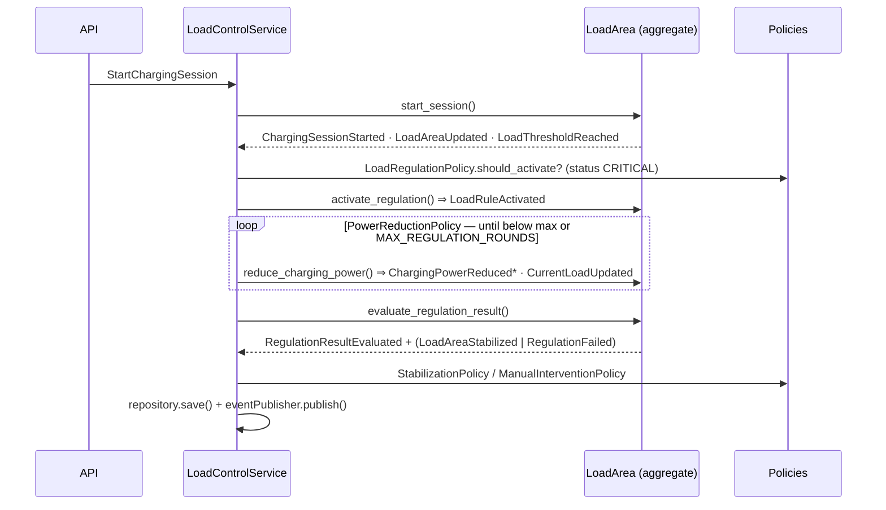

# Architecture

## Bounded context

The Load Management subdomain is realised as a single bounded context — the **Load Control
Context** — owned by one microservice, the **Load Control Service**. It owns: registration and
updating of charging sessions and load, evaluation against thresholds, activation of load rules and
regulation, and publication of domain events. It does **not** own billing, firmware or partner
settlement; those would integrate via events across context boundaries.

## Layered design (DDD)

```
┌──────────────────────────────────────────────────────────────┐
│ api            FastAPI routers + Pydantic schemas              │  ← system boundary, validation
│                app/load_control/api, app/analytics/api          │
├──────────────────────────────────────────────────────────────┤
│ application    use cases, the 4 named policies, ports (CQRS)   │  ← orchestration / workflow
│                app/load_control/application                     │
├──────────────────────────────────────────────────────────────┤
│ domain         LoadArea aggregate, entities, value objects,    │  ← business rules & invariants
│                domain events   (no framework, no SQL)           │     (pure Python)
├──────────────────────────────────────────────────────────────┤
│ infrastructure asyncpg repository, mappers, event store,       │  ← technology adapters
│                read-side queries                                │
└──────────────────────────────────────────────────────────────┘
```

Dependencies point inward: `infrastructure` and `api` depend on `application`/`domain`; the
`domain` depends on nothing. The repository is defined as an **abstract port**
(`domain/repository.py`) and implemented in infrastructure (`PostgresLoadAreaRepository`), so the
business rules never see a database row.

### CQRS-lite

- **Writes** go through the `LoadArea` aggregate (commands → invariants → events).
- **Reads** are served from warehouse **views** via `LoadAreaQueries` / `AnalyticsService`, never by
  loading the aggregate. This keeps the read and write models decoupled and lets the BI layer reuse
  the same projections.

## The regulation cascade

A single `POST /sessions` that overloads the area drives the full event-storming flow:



The aggregate **records** events; the application service **publishes** them only after the
transaction is persisted. The event publisher writes every event to the `domain_events` store and
projects load snapshots into `load_samples`, which feed the analytics/BI views.

## Data flow for BI vs Ops (kept separate)

- **Business Intelligence (§6):** `load_samples` + `domain_events` → warehouse views →
  `AnalyticsService` → `/analytics/*` → **React dashboard**.
- **Operational monitoring (§5):** FastAPI `/metrics` → **Prometheus** → **Grafana** dashboards +
  alert rules. No business data flows into Grafana.

## Scalability & security notes

- **Scalability:** the service is stateless (all state in PostgreSQL), so it scales horizontally
  behind a load balancer; `asyncpg` pooling and async I/O handle many concurrent sessions; reads are
  offloaded to views and could move to read replicas or materialised views.
- **Security:** all SQL uses bound parameters (injection-safe); input is validated at the API
  boundary by Pydantic; configuration/secrets come from environment variables, never committed.
